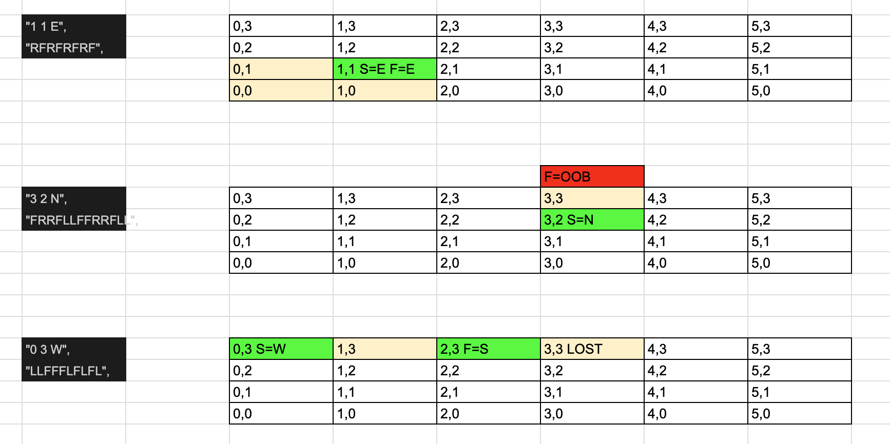

# red-badger-mars-project

Hello and thanks for taking the time to review my submission for this project as step 2 of the interview process for the Tech Lead role at Red Badger.

When completing challenges like these I like to begin by writing the Readme before writing any code so I can capture all of my thought process as I work on the project.

I've decided to work in Typescript today because its my favourite language! I was considering making a GUI for this to show the results but read in the spec that this is not the focus of the project.

This led me to the idea of using a TDD approach as I have been provided some inputs and outputs, so that is what I will do!

# Running the project

Simply run `npm i` then `npm t` to see tests passing

## Step 1 - Initialize Project

The first step is to initialize my project and get Jest running so I will do that.

I added typescript and `@types/node` as dev dependencies to the project then ran `npx tsc --init` to make the tsconfig.

I added some simple scripts to package.json to compile and run the app like:

`"start": "tsc && node build/index.js"`

Then I started to add jest, as I was doing so I realised I needed to remove an unwanted package (I want `@types/jest` not `@jest/globals`) which meant I needed to remove it from my package.json and hence a..

...REMINDER for myself:

Clone the repo clean before submission to ensure it works the same on all machines.

Now thats done, I added an `index.test.ts` file and changes my test script in package.json to "jest"

And `npm t` works now!

## Step 2 - Add the TDD results

As part of this step I want to take the inputs/outputs and add them to test files. This involves a few things:

1. I will make an output function called `run`. Right now I dont know what it will do, but I need to call it in my test to ensure as im working I can work towards the correct result.
2. I will make three tests (as there are 3 input/output pairs in the project spec) and the` expect()` call in the tests should match the output

On re-reading the spec I realise there is only 1 rather long output so I will make one test that takes this output instead of 3.

I think I will make the input to the `run` function a string array because it seems like there could be a variable number of inputs here .

Whilst writing the tests I realised I need prettier in my project to work faster, so I added it.

At the end of this step I have this:

`src/index.ts`

```
export const run = (input: string[]): string[] => {
  return input;
}
```

`src/index.test.ts`

```
import { run } from "./index";

describe("index", () => {

  it("should return the expected output from the project spec", () => {
    const sampleInput = [
      "5 3",
      "1 1 E",
      "RFRFRFRF",
      "3 2 N",
      "FRRFLLFFRRFLL",
      "0 3 W",
      "LLFFFLFLFL",
    ];
    const sampleOutput = ["1 1 E", "3 3 N LOST", "2 3 S"];
    const result = run(sampleInput);
    expect(result).toBe(sampleOutput);
  });
});
```

So now I will run `npm t -- --watch` and have this open for the remainder of development.

## Step 3 - Grid Input

I like to start with easy stuff and I noticed that the max characters in the input will be 100
So the first line of the function can simply check that we are not over 100 characters, then I can add a test for that.
I can use `array.join` for this.

Now thats out the way, we need to start reading co-ordinates, firstly the grid. Im going to create a class for this as it makes it easier to extend.
As I start writing im not sure how advanced this will need to be but I think a class/object will be the most extensible.

I created a Grid class that takes width and height in the constructor and creates a 2D array of empty strings. We can eventually use the string in the grid
to represent a place where a previous robot was lost by using LOST. I like using typescript templates for this as the type so it can just have either explicitly `" "` or `"LOST"` as the type

Now I can add a test that ensures the Grid creates correctly and also that the set and get functions I added work correctly.

Ive now moved onto reading the width and height from the first line of the input. I wanted to make a function that does this so I can test it correctly which I then did!

There was also a part of the spec that mentioned the coordinates should never be over 50 so I added that and tested for it too.

## Step 4 - Remaning input and robot movement

Next I wrote some code to read the remaning input and used a combination of a spread operator, a forEach on the remaining input elements and then a modular check to determine if the input is positional or movement

Then I realised it would be handy to house the robot code in a class too, so I made a class with some members `x`, `y`, `orientation` and also it needs to know the `grid` to check if it can move or not, so I added that too.

Then I added some methods to perform the movement and rotations.

I realised by storing the orientations in an array, then turning left is the same as moving an index backwards through the array and right is the same as moving an index forwards through the array

Here I realised my grid width reading code could be updated to read the orientation too, only if it was provided, so I updated my function to do that too and renamed it from `getWidthAndHeightFromInput` to `readCoordinatesAndOptionallyOrientation`

I quickly added some tests for it!

Then I created the robot after successfully reading the first line of coordinate input.

Then I started parsing the movement line. I added some code to read in the movement line which was a lot simpler than the coordinates seeing as they are all characters that must match "F", "R" or "L".
I added each instruction as an element to an array so they can be looped.

Then I just looped the array and performed the correct action on the robot class and added it to a result array.

## Step 5 - Lost Robot functionality.

For this I needed to add some checks in the movement to see if the next step would lead out of bounds. This is as easy as checking to see if the next grid position is undefined.

I added a catch for this in the `grid.get()` function to ensure that theres no confusion between an undefined index and an out of bounds array (although I guess theyre the same, its just easier to read this way.)

Then I added some code to check if there was a previously lost robot here by checking the current position. Only if there was no robot lost previously AND theres a command to go OOB, would the robot be lost.

If this is the case, we can mark that grid position as LOST. This then helps the subsequent robots to not get lost again

## Final Steps - getting the tests to pass!

At this point I had 2/3 robots passing the tests, but I was getting an error:

```
    TypeError: Cannot set properties of undefined (setting '0')

      23 |   set(x: number, y: number, value: GridValue) {
      24 |     console.log(x, y, value);
    > 25 |     this.grid[y][x] = value;
         |                    ^
      26 |   }
      27 | }

```

So I spent some time debugging.

I realised that I had misread the spec. The grid size is not what is placed in the input, its the upper right coordinate. So if the bottom right is 0,0 and the upper right is 5,3 it makes the grid size 6x4, not 5x3.

I fixed this by changing my grid initializing code, but im still struggling to pass the last input/output pair:

```
  ● index › should return the expected output from the project spec

    expect(received).toBe(expected) // Object.is equality

    - Expected  - 1
    + Received  + 1

      Array [
        "1 1 E",
        "3 3 N LOST",
    -   "2 3 S",
    +   "3 3 undefined",
      ]
```

After a long debugging process, I found the bug!! 🎉

I tried initially printing the grid to see if the LOST was being marked correctly.

It was, I was receiving:

    OOOOOO
    OOOOOO
    OOOOOO
    OOOLOSTOO

So I figured that the LOST was being ignored in my Robot movement code, as the final position was always ending up as undefined (I now realise this was my biggest clue to the solution.)

Struggling, I decided to map out all the inputs and movements on Excel:



But this just led me to understand the inputs better and didnt give me an understanding of why this wasnt working. So I took a short break honestly and when I came back I realised that if I could rule out the LOST code working correctly in movement then the bug must be somewhere else.

Finally I had an incling that my turning code wasnt working correctly. Because I wrote the turnRight code first and used a modulus to increment in a looping fashion throughout my function, then surely the turnLeft code just needs to be a decrement, right?

Buggy code:

```
 turnLeft() {
    const currentOrientationIndex = orientations.indexOf(this.orientation);
    const newOrientationIndex = (currentOrientationIndex - 1) % 4;
    this.orientation = orientations[newOrientationIndex];
  }
```

Well I tested this in the terminal and this is in fact not the case.

```
> -1 % 4
-1
```

So I realised that I actually needed to be ensuring that the orientation was kept in the positive by adding the length of the array to it:

Fixed code:

```
turnLeft() {
    const currentOrientationIndex = orientations.indexOf(this.orientation);
    const newOrientationIndex = (currentOrientationIndex - 1 + 4) % 4;
    this.orientation = orientations[newOrientationIndex];
  }
```

Et viola, it started working! All tests were passing so Im calling this work done!

## Next steps

I like my solution. You may notice that I made uses of a lot of classes and I think thats probably due to my C/C++ background. I used to code a lot of games so I like the Object Oriented pattern.

If I had my time again, I would have tested my robot class better because it turned out one of the functions on it was broken. So I would have definitely written unit tests for the movement and turning functions.

I think this solution is extensible. If you wanted to add more commands or hazards this would be as easy as adding more methods to either the grid or Robot class.
